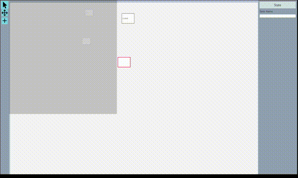

# State-Machine Diagram Editor

This is an assignment I completed for CMPT 381 during the Fall 2022 Term at the UofS. The goal was to make a basic state-machine editor with editable state transitions and named states. It is published here
to demonstrate some competency in writing small-skill apps.

### Demo

Sped-up example of building a state-machine representation of the TCP protocol

### Running

In the project root directory:

`mvn install && mvn javafx:run`
